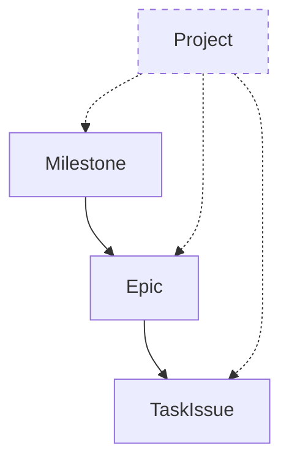

# GitHub 项目管理层级关系

GitHub 提供多个层级来组织和追踪开发任务。以下内容总结了 Milestone、Epic、Task Issue 与 Project 之间的角色、关系以及常见用法。

## Milestone

- **定义**：一个阶段性目标或交付物的时间盒。
- **作用**：聚合一组 Issue，追踪阶段性完成进度。
- **特点**：
  - 可以包含多个 Epic 或 Task Issue。
  - 用于追踪如 MVP、迭代版本等阶段性目标。
- **示例**：
  - `Milestone: MVP` → 目标：完成最小可用版本。
  - `Milestone: Hybrid Search` → 目标：增强检索能力。

## Epic（父 Issue）

- **定义**：一个较大需求或功能集合，通常由一个普通 Issue 承担。
- **作用**：作为多个子任务的“总览 Issue”，用来跟踪进度。
- **特点**：
  - 本质是普通 Issue，在正文中通过 checklist 引用子任务。
  - 可以横跨一个或多个 Milestone。
- **示例**：
  - `Epic: 构建 RAG 系统 (Go + Gin + PGVector + Redis) (#1)`
  - 包含 `#12, #13, #14 ...`

## Task Issue（子任务）

- **定义**：最小可执行的开发任务。
- **作用**：实现具体功能点，可被指派给开发者，通过 PR 完成。
- **特点**：
  - 必须归属某个 Milestone。
  - 可以在 Epic Issue 中被引用。
- **示例**：
  - `#12 [MVP] PostgreSQL & Redis 基础环境`
  - `#13 [MVP] GitHub 仓库同步`

## GitHub Project

- **定义**：跨 Milestone 的看板/表格，用于管理任务状态。
- **作用**：提供任务的动态视图（如 ToDo / In Progress / Done），适合作为迭代管理工具。
- **特点**：
  - 可以放入多个 Milestone 的 Issue。
  - 支持自定义视图、字段和自动化。
- **示例**：
  - `Project: RAG System Dev Board`
    - Backlog: `#12, #13`
    - In Progress: `#14`
    - Done: `#10`

## 层级关系总结

| 层级 | 在 GitHub 中的实现方式 | 关系 |
| ---- | ---------------------- | ---- |
| Milestone | 阶段性目标/交付物 | 包含多个 Epic & Task Issue |
| Epic | 父 Issue（普通 Issue + Checklist） | 引用多个 Task Issue |
| Task Issue | 普通 Issue，最小开发任务 | 属于 Milestone，被 Epic 引用 |
| Project | 看板/表格视图 | 跨 Milestone 管理 Task Issue |

## Mermaid 层级关系图

该图示展示了 Milestone、Epic 与 Task Issue 的嵌套关系，以及 Project 对这些对象的跨层级管理能力。

