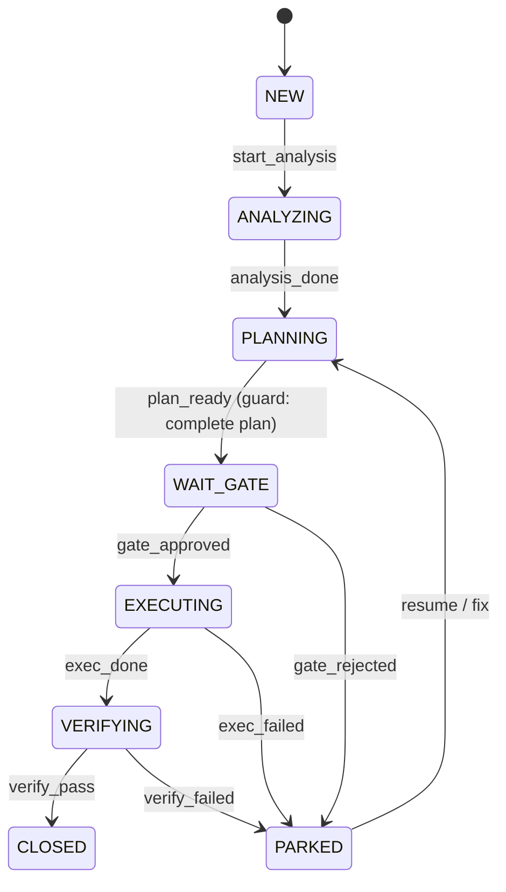

# 如何设计 AI 驱动的 OPS Agent：漫谈状态机

> 关键词：Walking Skeleton／状态机（FSM）／Outbox／Idempotency／事件驱动／LLM 契约化

本文落地一条“最短闭环”（人工触发 → 计划 → 审批 → 执行 → 验证 → 归档），强调：**确定性的状态机做“合法性与原子落库”，不确定性的 LLM 做“生成、检索、归纳”**，两者以“可验证的契约”交汇。

---

## 0. 结论先行（TL;DR）
- **状态唯一事实源（SSOT）在 Orchestrator**：唯一改状态入口 `PATCH /case/{id}/transition`；事务内同时写 `ops_case`、`case_timeline`、`outbox`；所有副作用“先出盒，后投递”。
- **AI 的边界**：LLM 负责 Planner/Analyst/Librarian 的“生成与检索”；Gatekeeper 的策略判定与 Orchestrator 的状态迁移一律**不可由 LLM 直接驱动**，而是通过**结构化产物 + 守卫校验**进入确定世界。
- **Walking Skeleton 顺序**：Orchestrator → Planner → Gatekeeper → Executor → Verifier（打通闭环）；其后再补 Analyst、Sensor、Librarian（从命令式走向信号驱动与知识化）。

---

## 1. 为什么状态机是 AI OPS 的地基
LLM 擅长“生成与归纳”，但**不提供事务性与幂等保证**。生产级 OPS 需要：
1) **可证明的合法迁移**（纯函数 FSM）
2) **原子副作用**（状态 + 时间线 + 出盒）
3) **至少一次投递 + 消费幂等**（Outbox/Inbox Pattern）

> 原则：**确定性包围不确定性**。所有非确定性的 AI 产物都转为**结构化契约**（JSON/YAML + Schema 校验）后，才允许进入状态机的下一跳。

---

## 2. Walking Skeleton（从零到可跑）
**目标**：先打通一条最短闭环，可演示、可观测、可回滚。

**实现顺序**：
1. **Orchestrator（必须先做）**：纯函数 FSM + 原子事务（状态/时间线/出盒）+ 幂等/OCC。
2. **Planner（最小可用）**：模板计划生成，产出 `plan_proposed` 与 `evt.plan.proposed.v1`。
3. **Gatekeeper（自动审批）**：本地策略阈值，产出 `plan_approved` 与 `evt.plan.approved.v1`。
4. **Executor（Step Runner）**：先做 `echo/script` 与 `k8s rollout` 两个适配器。
5. **Verifier（SLO 校验）**：基于 `metric_1m` 的阈值判定。
6~8. **Analyst / Sensor / Librarian**：把入口从“人工”扩展到“信号驱动”，把 Planner 从模板升级为基于证据的拟合。

---

## 3. 体系结构与事件流
```mermaid
flowchart LR
  subgraph UI/API
    H[Human/UI]
  end

  subgraph Core[Core Services]
    O[Orchestrator\nFSM+Outbox+Timeline]
    P[Planner\n(LLM/模板→ plan_proposed)]
    G[Gatekeeper\n(策略/OA判定)]
    E[Executor\n(Adapters: script/k8s/...)]
    V[Verifier\n(SLO阈值)]
    A[Analyst\n(规则/统计→ findings)]
    S[Sensor\n(oo_locator / ingest)]
    L[Librian\n(pgvector RAG)]
  end

  EV[(Event Bus\nNATS/Redpanda)]
  DB[(PostgreSQL/Timescale)]
  OO[(OpenObserve/Logs)]

  H -- REST --> O
  O -- outbox/cmd.* --> EV
  EV -- evt.* --> O
  P & G & E & V & A & S & L -- evt./cmd. <--> EV
  O -- R/W --> DB
  E -- logs/refs --> OO
```

**接口与事件最小集**
- REST：
  - `POST /case/create`，`GET /case/{id}`，`GET /case/{id}/timeline`
  - `PATCH /case/{id}/transition`（**唯一改状态入口**；需 `Idempotency-Key` + 建议 `If-Match`）
  - `POST /plan/generate`，`POST /gate/eval`，`POST /adapter/exec`，`POST /verify/run`
- 事件：
  - `evt.case.transition.v1`（任何迁移事实）
  - `evt.plan.proposed.v1`，`evt.plan.approved.v1`
  - `evt.exec.step_result.v1`，`evt.exec.done|failed.v1`
  - `evt.verify.pass|failed.v1`，`evt.analysis.findings.v1`
  - `cmd.plan.generate / cmd.gate.eval / cmd.exec.run / cmd.verify.run`

---

## 4. 状态机（FSM）与守卫


**守卫示例（plan 完整性）**
- `steps` 至少 1 个；每个 step 定义 `action`、`timeout`、`retry`；
- `rollback` 与 `verify` 字段必须存在；
- 计划大小、危险操作需标识并由 Gatekeeper 评分/审批。

> 任何守卫失败都不改变状态，仅记录时间线并返回 409/422。

---

## 5. Orchestrator 的“原子三件套”
**单事务保证**：
1) 更新 `ops_case.version, status`
2) 追加 `case_timeline`
3) 写入 `outbox`（cmd.* 或 evt.* 载荷）

**幂等与并发**：
- `Idempotency-Key`：命中即返回首次结果，不重复写时间线/出盒。
- `If-Match`/`expected_version`：不匹配 → `409/412`。

**伪代码（Go/Pseudocode）**：
```go
func Transition(ctx, caseID, event, meta) (Case, error) {
  return WithTx(ctx, func(tx Tx) (Case, error) {
    c := repo.GetForUpdate(tx, caseID)
    allowed, next := workflow.Decide(c.Status, event)
    if !allowed { return error(409) }

    // guards (schema/plan completeness/risk window etc.)
    if err := Guards.Pass(tx, c, event, meta); err != nil { return error(422) }

    c.Status, c.Version = next, c.Version+1
    repo.Update(tx, c)

    timeline.Append(tx, c.ID, event, meta)

    outbox.Append(tx, BuildMessages(c, event, meta))

    return c, nil
  })
}
```

---

## 6. LLM “做擅长的事”：契约与位置
> **口号**：LLM 只输出“结构化、可验证、可回放”的产物；状态改变永远经 Orchestrator。

### 6.1 Planner × LLM（计划生成）
- **输入**：问题摘要、上下文证据（`evidence_link`）、历史相似案 `kb_chunk`、环境约束。
- **输出契约（JSON Schema）**：
```json
{
  "$schema": "https://json-schema.org/draft/2020-12/schema",
  "title": "ChangePlan",
  "type": "object",
  "required": ["title","steps","rollback","verify"],
  "properties": {
    "title": {"type":"string"},
    "risk_score": {"type":"number","minimum":0,"maximum":1},
    "steps": {
      "type":"array","minItems":1,
      "items": {"type":"object","required":["action","timeout_s","retry"],
        "properties": {
          "action": {"enum":["k8s.rollout","script.exec","gateway.flip","noop"]},
          "params": {"type":"object"},
          "timeout_s": {"type":"integer","minimum":10},
          "retry": {"type":"integer","minimum":0,"maximum":3}
        }
      }
    },
    "rollback": {"type":"object"},
    "verify": {"type":"object"}
  }
}
```
- **流程**：`/plan/generate` → 校验 Schema → 入库 `plan_proposed` → 发 `evt.plan.proposed.v1`。

**Prompt 片段（示意）**：
```
System: 你是资深 SRE。产出必须是符合 JSON Schema 的 ChangePlan。不要输出自然语言解释。
User: {问题摘要/证据/限制}
Assistant: {ChangePlan JSON}
```

### 6.2 Analyst × LLM（证据摘要）
- LLM 用于**长日志/多指标的摘要**，把粗粒度“异常信号”转换成**可检索的要点**（写入 `event_envelope`）。
- 开 Case 的动作依然通过 Orchestrator（NEW→ANALYZING）。

### 6.3 Librarian × LLM（RAG）
- `kb_doc/kb_chunk`（pgvector）做相似案例/Runbook 检索；LLM 用于**拟合与注释**，生成可执行/可审阅的 Plan。

### 6.4 Gatekeeper/Verifier 的 AI 用法（限定）
- **Gatekeeper**：策略由**确定性规则**实现，可让 LLM 提供“风险解释文本”，但**不直接决定通过与否**。
- **Verifier**：阈值判断（p95/err_rate）是确定性的；LLM 可做**事后报告**摘要。

---

## 7. 数据模型（关键表，最小集）
```sql
-- 1) 事实源
CREATE TABLE ops_case (
  id UUID PRIMARY KEY,
  tenant TEXT, title TEXT,
  status TEXT NOT NULL,
  version INT NOT NULL,
  created_at TIMESTAMPTZ DEFAULT now(),
  updated_at TIMESTAMPTZ DEFAULT now()
);

CREATE TABLE case_timeline (
  id BIGSERIAL PRIMARY KEY,
  case_id UUID REFERENCES ops_case(id),
  event TEXT, actor TEXT, reason TEXT,
  correlation_id TEXT, meta JSONB,
  created_at TIMESTAMPTZ DEFAULT now()
);

CREATE TABLE outbox (
  id BIGSERIAL PRIMARY KEY,
  topic TEXT, key TEXT, payload JSONB,
  created_at TIMESTAMPTZ DEFAULT now(),
  published_at TIMESTAMPTZ
);

CREATE TABLE idempotency (
  key TEXT PRIMARY KEY,
  response JSONB,
  created_at TIMESTAMPTZ DEFAULT now()
);

-- 2) Planner/Exec/Verify（示意）
CREATE TABLE plan_proposed (
  id UUID PRIMARY KEY,
  case_id UUID REFERENCES ops_case(id),
  plan JSONB NOT NULL,
  created_at TIMESTAMPTZ DEFAULT now()
);
CREATE TABLE plan_approved (
  id UUID PRIMARY KEY,
  case_id UUID REFERENCES ops_case(id),
  decision JSONB,
  created_at TIMESTAMPTZ DEFAULT now()
);
```

---

## 8. 可观测性（先打指标，再写业务）
- **Prom 指标**：
  - `case_transition_total{from,to,event}`
  - `conflict_total{reason}`（409/412/422）
  - `idempotent_replay_total`
  - `outbox_publish_total{topic,status}` / `inbox_dedup_total`
  - `adapter_step_latency_seconds`、`verify_latency_seconds`
- **Tracing**：每次迁移、每个 step、每次查询都带 `trace_id` 并写入 `case_timeline.meta`。
- **日志引用**：`exec_step.*_ref` 指向 OO/Loki 的 `oo_locator`。

---

## 9. 第一条端到端演示（cURL）
```bash
# 1) 创建 Case
CASE=$(curl -sX POST /case/create -d '{"title":"p95 spike","tenant":"t-001"}'|jq -r .data.case_id)

# 2) 开始分析
curl -X PATCH /case/$CASE/transition \
  -H 'Idempotency-Key:a1' \
  -d '{"event":"start_analysis","actor":"analyst@svc"}'

# 3) 生成计划（模板/LLM）
curl -X POST /plan/generate -d '{"case_id":"'$CASE'","template":"k8s.rollout.canary"}'
# Planner 发 evt.plan.proposed.v1 → Orchestrator 判定 plan_ready → WAIT_GATE

# 4) 自动审批
curl -X POST /gate/eval -d '{"case_id":"'$CASE'"}'
# Gatekeeper 发 evt.plan.approved.v1 → EXECUTING

# 5) 执行适配器（示例：script）
curl -X POST /adapter/exec -d '{"case_id":"'$CASE'","adapter":"script","script":"echo ok"}'
# Executor 发 evt.exec.done.v1 → VERIFYING

# 6) 验证通过 → CLOSED
curl -X POST /verify/run -d '{"case_id":"'$CASE'"}'
```

---

## 10. 目录结构建议
```
.
├─ api/                # Gin/Fiber + OpenAPI + 中间件
├─ workflow/           # 纯函数 FSM
├─ plans/              # 纯函数计划生成（模板 + LLM 契约）
├─ gatekeeper/         # 策略引擎（本地规则/OPA/Cedar）
├─ executor/
│  ├─ adapters/        # k8s/script/gateway...
│  └─ runner/          # step 执行/超时/重试
├─ verifier/
├─ analyst/
├─ sensor/
├─ librarian/
├─ internal/pubsub/    # NATS/Redpanda（至少一次 + 去重）
├─ ports/              # Repo/Outbox/Timeline/Idempotency 接口
├─ services/           # Orchestrator 等聚合服务
└─ migrations/         # DDL
```

---

## 11. DoD 清单（可直接转 Issue）
- **Orchestrator**：三类集成测试全绿（非法迁移409 / 幂等重放 / 失败落PARKED）；
  指标 `case_transition_total / conflict_total / idempotent_replay_total`；Outbox 消费无重复副作用。
- **Planner**：`plan_proposed` 入库；DSL 过 schema；守卫挡下不完整计划。
- **Gatekeeper**：策略可配置（文件/内存）；自动审批延时 <1s；拒绝落 PARKED 并记原因。
- **Executor**：≥2 适配器；step 超时/重试；失败回写 `exec_failed` 并落 PARKED。
- **Verifier**：SLO 查询正确；阈值/窗口可配；误报率可控。
- **Analyst**：能从 `metric_1m` 发现简单异常并自动开 Case。
- **Sensor**：`oo_locator` 可被 `evidence_link` 回链；写入 p99 < 2s。
- **Librarian**：topK 语义检索可用于计划注释/回滚提示。

---

## 12. 风险与避坑
1) 事务一致性：禁止在 FSM 回调内做外部 IO；**先落地再发事件**。
2) 幂等：所有写接口都要 `Idempotency-Key`；消费者对 `message_id` 去重。
3) 并发：`SELECT ... FOR UPDATE` + 版本控制；冲突返回 409/412。
4) 守卫松紧：先宽后紧，避免卡死；策略统一在 Gatekeeper。
5) 可观测：**先打指标**，再写业务；没有指标就无法排障。

---

## 13. 路线图（建议）
- **Phase 0**：FSM + Outbox + 2 个适配器 + 阈值 Verifier（闭环演示）。
- **Phase 1**：Analyst（规则）＋ Librarian（RAG）→ Planner/Runbook 拟合。
- **Phase 2**：Gatekeeper 外挂 OPA/Cedar；Executor 扩充生产适配器；Verifier 引入 SLO 画像。

---

### 一句话
> **Orchestrator 只做两件事**：判定合法迁移（纯函数）＋一次事务内记录（状态/时间线/出盒）。其余模块要么被它的命令驱动，要么把“事实事件”交还它，由它来改变世界。LLM 负责提出“更好的方案”，而不是亲自“按下回车”。

