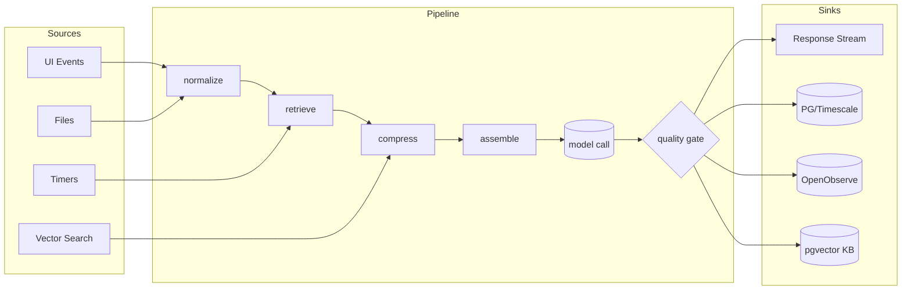
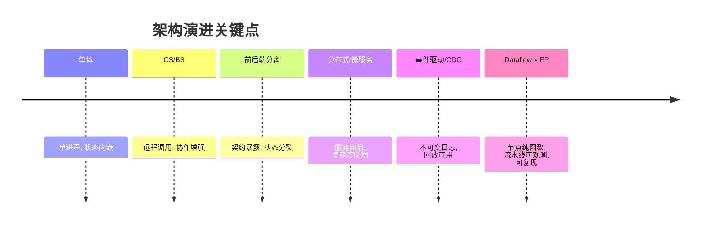

# 软件与数据流

## AI 原生应用的统一范式（Dataflow × FP）

> TL;DR：现代应用的本质是“**数据在图（DAG）上的流动**”。将 **函数式（FP）+ 数据流（Dataflow）** 作为统一范式，可以在 Web/桌面/后端与 AI 推理管线之间建立一致的抽象：**一切皆流、节点皆纯函数、状态外置、契约优先、可观测可解释、确定可测试**。这套方法让我们轻松实现 RAG、质量门禁、证据链与 OTel 埋点，支撑 A/B/Shadow 与回放重算。

---

## 目录
1. 为什么“软件 = 数据在图上的流动”
2. 架构演进：单体 → CS/BS → 前后端分离 → 分布式/事件驱动 → Dataflow × FP
3. 统一范式六原则（Dataflow × FP）
4. AI 原生应用的数据流形态（Sources → Transforms → Model → Gates → Sinks）
5. 数据与存储分层（近线 I/O × 治理/知识 × 策略）
6. RAG 流 DSL（可读可编排）
7. 目录与接口（最小项目骨架）
8. 可观测与可解释：证据链与 OTel
9. 最小代码片段（Go 节点链 + Next.js SSE + OPA 门禁 + PG DDL）
10. 渐进式落地路线与常见坑

---

## 1. 为什么“软件 = 数据在图上的流动”
- **统一抽象**：从按钮点击到模型输出、到审计日志，本质都是**不可变消息**在 DAG 上**沿着边流动**；节点是函数、边承载上下文和时序。
- **端到端可观测**：天然插入 Span/Attributes，流水线每步可度量；证据链把“如何得到这个结果”结构化存档。
- **确定与可测试**：把副作用下沉到边缘适配器，节点保持纯粹（`y = f(x)`）；固定 seed/前后处理，实现可重放。
- **弹性与性能**：背压、并行度、窗口、重分区，都是对“流”的形态操作；比 RPC 栈更自然地吸收突发与不确定性。

### 一个小图：


---

## 2. 架构演进：单体 → CS/BS → 前后端分离 → 分布式/事件驱动 → Dataflow × FP

| 阶段 | 代表形态 | 主要驱动 | 局限 | 向 Dataflow 的过渡 |
|---|---|---|---|---|
| 单体（Monolith） | Web/桌面一体化 | 快速迭代、单进程 | 难以扩展/协作 | 拆出“模块”→“算子”，明确输入/输出 |
| CS/BS | 客户端/浏览器—服务器 | 带宽/交互升级 | 状态耦合、接口脆弱 | 把界面视为**信号源**，RPC 退位为**流汇点** |
| 前后端分离 | SPA + REST/GraphQL | 前端工程化 | 数据契约多版本、状态分裂 | **Schema Registry** + **事件化接口** |
| 分布式/微服务 | 服务拆分 + MQ/ESB | 团队规模/自治 | 呼叫风暴、链路不透明 | **事件驱动** → **数据流编排**，端到端 Span |
| 事件驱动/CDC | Topic/Log → 订阅 | 解耦/回放 | 语义欠缺、幂等困难 | 强化**不可变消息** + **幂等键** + **重放** |
| Dataflow × FP | DAG + 纯函数 + 适配器 | AI/实时/可解释 | 需要契约与工具 | 统一范式：**一切皆流、节点纯、状态外置** |

> 关键转折：**把状态“从函数体里搬出去”**（Event Sourcing / 物化视图），副作用从“节点内隐”变为“边缘显式适配器”。

---

## 3. 统一范式六原则（Dataflow × FP）
1. **一切皆流**：事件、文件、特征、模型输出、审计……统一为不可变消息。
2. **节点是纯函数**：`y = f(x)`，幂等、可缓存、可快照测试；副作用（IO/模型调用）交给**边缘适配器**。
3. **状态外置**：Event Sourcing + Materialized View；重放即恢复，天然支持灰度/回滚/对账。
4. **数据契约优先**：Schema（Avro/Protobuf/JSONSchema）+ 版本化；流/批同 Schema。
5. **可观测可解释**：每条边注入 Trace/Span/Attributes；每个节点产出**证据链**（inputs → outputs → metadata）。
6. **确定性与可测试**：固定 seed、稳定前后处理；算子单测 + 快照；端到端回放对比。

---

## 4. AI 原生应用的数据流形态
**Sources** → **Transforms（纯函数）** → **Model Calls（受控副作用）** → **Policies & Gates** → **Sinks**。

- **Prompt/Context 数据化**：把 prompt 当结构化输入；RAG 是“检索流 → 压缩流 → 组装流”。
- **缓存与幂等**：`Key = hash(inputs, model, seed, tools, version)`；命中即返回，否则推理。
- **质量门禁**：BLEU/ROUGE/自评、一致性、策略（OPA/Cedar）；**不达标 → 改写/降级/回退**。

---

## 5. 数据与存储分层
- **近线 I/O 面（高吞吐）**：OpenTelemetry → **OpenObserve**（Logs/Metrics/Traces → 对象存+列式/WAL）。
- **治理/知识面**：**PostgreSQL + Timescale**（连续聚合/长保留）+ **AGE**（时态拓扑）+ **pgvector**（知识/相似案例）。
- **流总线**：**Redpanda/Kafka**（事实与回放）；可选 Flink/Materialize 做增量视图。
- **策略与合规**：**OPA/Cedar**；质量阈值/风险评分作门禁算子。
- **数据契约**：Avro/Protobuf + Schema Registry；蓝绿/影子发布走双写双读。

---

## 6. RAG 流 DSL（可读可编排）
```yaml
# flows/rag.yaml
flow: faq-rag
nodes:
  - id: normalize       # 纯函数
  - id: retrieve        # 向量检索（pgvector/FAISS 等）
  - id: compress        # 片段压缩/MapReduceSumm
  - id: assemble        # Prompt 组装
  - id: call_model      # 模型调用（受控副作用，可流式）
  - id: quality_gate    # 质量门禁（<阈值→改写/回退）
  - id: persist         # PG/OO 落盘（证据链）
edges:
  - normalize -> retrieve -> compress -> assemble -> call_model -> quality_gate -> persist
```

**埋点约定（Attributes）**：
```
schema.ver, node.id, node.ver, input.hash, output.hash,
model.name, model.seed, tools, cost.tokens, retries
```

---

## 7. 目录与接口（最小项目骨架）
```
ai-app/
├─ flows/                  # DAG 定义（YAML/DSL）
│  └─ rag.yaml
├─ ops/                    # 策略/门控（OPA/Cedar）
├─ pkg/
│  ├─ nodes/               # 纯函数算子
│  ├─ sinks/               # PG/OO/KV/对象存
│  └─ adapters/            # LLM/VDB/外部工具
├─ services/
│  ├─ gateway/             # SSE/WS，对应前端信号
│  └─ scheduler/           # 流编排/重放/回填
├─ schemas/                # Avro/Proto/JSONSchema
└─ db/                     # DDL/迁移与示例查询
```

**HTTP 接口（示例）**
- `POST /ask`：请求体 `{query, kb, user, seed?}`；响应为 **SSE 流**（`data: token`）。
- `POST /flows/:id/replay`：按窗口重放；参数含 `from, to, key?`。
- `GET /traces/:run_id`：返回该次流水线的证据链与指标摘要。

---

## 8. 可观测与可解释：证据链与 OTel
- **每条边 = 一个 Span**：在 Attributes 写入 `{schema.ver, node.ver, input.hash, output.hash, cost}`。
- **证据链（evidence_link）**：
  - 输入片段（检索文档 ID + 片段哈希）
  - Prompt（模板/变量）与模型配置（model/seed/tools）
  - 输出摘要、质量评分与门禁决策
  - Run/Trace ID（便于复现与审计）
- **线上评估**：A/B 与 Shadow 比较延迟、命中率、质量分、成本/千 token。

---

## 9. 最小代码片段

### 9.1 Go：有界并发的“模型调用”算子
```go
// pkg/nodes/pipeline.go
package nodes

type Msg struct{ Key string; Payload []byte }

func Map(in <-chan Msg, f func(Msg) Msg, buf int) <-chan Msg {
  out := make(chan Msg, buf)
  go func() { defer close(out); for m := range in { out <- f(m) } }()
  return out
}

func ModelCall(in <-chan Msg, call func(Msg) (Msg, error), buf, workers int) <-chan Msg {
  out := make(chan Msg, buf)
  sem := make(chan struct{}, workers)
  go func() {
    defer close(out)
    for m := range in {
      sem <- struct{}{}
      go func(m Msg) {
        defer func(){ <-sem }()
        // 命中幂等缓存直接返回
        if v, ok := LookupCache(m.Key); ok { out <- v; return }
        // 受控副作用（可包裹 OTel Span）
        y, _ := call(m)
        PutCache(m.Key, y)
        out <- y
      }(m)
    }
    // drain
    for i:=0;i<cap(sem);i++{ sem<-struct{}{} }
  }()
  return out
}
```

### 9.2 Next.js（SSE 流式渲染）
```ts
// apps/web/pages/index.tsx
import { useEffect, useState } from 'react'
export default function Page(){
  const [q, setQ] = useState('')
  const [out, setOut] = useState('')
  useEffect(()=>{
    if(!q) return
    const es = new EventSource(`/api/ask?q=${encodeURIComponent(q)}`)
    es.onmessage = (e)=> setOut(o=> o + e.data)
    es.onerror = ()=> es.close()
    return ()=> es.close()
  },[q])
  return (
    <main>
      <input value={q} onChange={e=>setQ(e.target.value)} placeholder="Ask..."/>
      <pre>{out}</pre>
    </main>
  )
}
```

### 9.3 OPA 门禁（示意）
```rego
# ops/quality.rego
package quality

default allow = false

min_len = 64

allow {
  input.metrics.tokens <= input.budget.tokens
  input.metrics.output_len >= min_len
  not deny_reason
}

deny_reason {
  input.metrics.toxicity > 0.2
}
```

### 9.4 PostgreSQL：证据链与质量评分
```sql
-- db/schema.sql
CREATE EXTENSION IF NOT EXISTS pgcrypto;

CREATE TABLE IF NOT EXISTS event_envelope (
  id UUID PRIMARY KEY DEFAULT gen_random_uuid(),
  run_id UUID NOT NULL,
  node_id TEXT NOT NULL,
  input_hash TEXT NOT NULL,
  output_hash TEXT,
  started_at TIMESTAMPTZ DEFAULT now(),
  finished_at TIMESTAMPTZ,
  attrs JSONB DEFAULT '{}'
);

CREATE TABLE IF NOT EXISTS evidence_link (
  id UUID PRIMARY KEY DEFAULT gen_random_uuid(),
  run_id UUID NOT NULL,
  kind TEXT NOT NULL,            -- doc|prompt|config|output
  ref TEXT NOT NULL,             -- 文档ID/路径/模板名
  hash TEXT,
  snippet TEXT,
  meta JSONB DEFAULT '{}'
);

CREATE TABLE IF NOT EXISTS quality_eval (
  id UUID PRIMARY KEY DEFAULT gen_random_uuid(),
  run_id UUID NOT NULL,
  metric TEXT NOT NULL,          -- bleu|rouge|self_consistency|toxicity
  value DOUBLE PRECISION NOT NULL,
  meta JSONB DEFAULT '{}',
  decided BOOLEAN DEFAULT FALSE  -- 是否触发 gate 决策
);
```

---

## 10. 渐进式落地路线与常见坑
**落地路线**
1) 先把现有业务串成“可重放的最小流”（接口不变，内部改成算子链）。
2) 上 Schema Registry + 输入/输出哈希；引入幂等缓存与 Trace。
3) 把副作用下沉到适配器，核心逻辑**纯函数化**。
4) 在关键链路接入**质量门禁**，再做 A/B 或 Shadow。
5) 做**回放/补算**，打通审计与回归测试；沉淀证据链。

**常见坑**
- 仅做“消息化”而没做“**不可变** + **幂等键**”，回放仍不可复现。
- 只接了 OTel SDK，没有**统一埋点约定**（属性命名/版本/哈希）。
- 把门禁做成“外部服务”而非**流水线算子**，导致链路分叉不可观测。
- 只做 RAG 不做**质量阈值/风险评分**，上线后质量漂移无感知。

---

### 附：演进一页图


---

> 参考实现建议：
> - 流编排：`flows/*.yaml` → 代码生成或轻量解释执行。
> - 埋点模板：在 `pkg/tracing` 里实现 `Tracer` 接口（`noop`/`otel` 双实现）。
> - 回放工具：`services/scheduler` 暴露 `POST /flows/:id/replay`，对接 Timescale 窗口。
> - 门禁策略：OPA/Cedar 写在 `ops/`，以算子形式嵌回流水线。
> - 数据契约：`schemas/` 存放 Avro/Proto，CI 校验兼容性。

